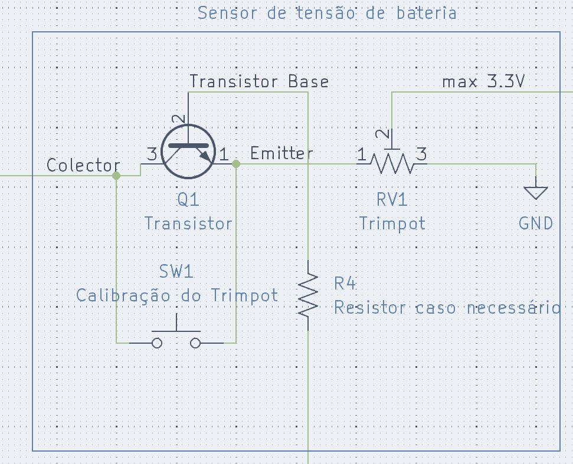

# Código

O pino a ser escolhido deve ser um pino com suporte ADC.
Em relação ao channel a ser escolhido, existe uma relação channel/pin, que pode ser vista no arquivo `zephyrproject/modules/hal/stm32/dts/st/f1/stm32f103c(8-b)tx-pinctrl.dts`.
Por exemplo, se você quiser utilizar o pino A0, então a partir desse arquivo vemos que precisamos utilizar o canal 0 (por causa do in0):

```dtsi
/omit-if-no-ref/ adc1_in0_pa0: adc1_in0_pa0 {
  pinmux = <STM32F1_PINMUX('A', 0, ANALOG, NO_REMAP)>;
};
```
# Esquemático



Este esquemático utiliza um Transistor NPN, mas um PNP pode ser utilizado (lembre-se de modificar o circuito de acordo).

O Colector recebe 12V, que são passados para o Emitter caso a Base receba 5V. O botão é utilizado para calibrar o Trimpot, e o STM deve ser desconectado ao fazer isto.
